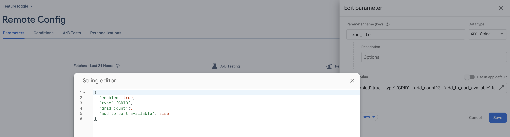

# FeatureToggle
Android FeatureToggle library which helps to provide feature toggles on any flavors and manage it by different types:
harcode, resources, remote, with local file storage and with debug panel activity.


# Using FeatureToggle 

FeatureToggle modules can be obtained from the [github packages](https://maven.pkg.github.com/IlyaPavlovskii/FeatureToggle). 
It's also possible to clone the repository and depend on the modules locally.
Just add the next repository to the dependency resolution manager:

```
dependencyResolutionManagement {
    repositories {
    	// Use staging maven repository until the publish version on review
    	mavenCentral() 
    	// or    	 
    	maven {
            url = uri("https://s01.oss.sonatype.org/service/local/repositories/releases/content/")
        }
    }
}
```

Connect `feature-toggle` library to your project to start using it:

```
implementation("io.github.ilyapavlovskii:feature.toggle:X.X.X")
```

If you want to use `debug-panel`, just add the next dependency:

```
implementation("io.github.ilyapavlovskii:debug.panel:X.X.X")
```

---------------------------------------------------------------------------
# How to use
### FeatureToggleContainer

To start using `FeatureToggle`, first what you need is to define `FeatureToggleContainer`.
`FeatureToggleContainer` - that class uses to register all `FeatureToggle` instances that might be used in application.
Uses as a fallback, in the case when none of the configurations overloads the `FeatureToggle` values, the values will be taken from the container. 

```
private val featureToggleContainer: FeatureToggleContainer = SimpleFeatureToggleContainer(
    featureToggles = setOf(
        SampleTitleFeatureToggle(
            enabled = true,
            title = "Sample FeatureToggle",
        ),
        RestaurantInfoFeatureToggle(
            mapVisible = true,
            deliveryCostsVisible = true,
            ratingVisible = true,
        ),
        MenuItemFeatureToggle(
            enabled = true,
            gridCount = 3,
            type = MenuItemFeatureToggle.PreviewType.HORIZONTAL_LIST,
            addToCartAvailable = true,
        )
    )
).also { featureToggleContainer ->
	// Don't forget to initialize `FeatureToggleContainerHolder`
	FeatureToggleContainerHolder.init(featureToggleContainer)
} 
//...
@Serializable
internal data class SampleTitleFeatureToggle(
    val enabled: Boolean,
    val title: String,
) : FeatureToggle {
    override val toggleKey: FeatureToggleKey = FeatureToggleKey(KEY)

    companion object {
        private const val KEY = "sample_title"
    }
}
@Serializable
internal data class RestaurantInfoFeatureToggle(
    @SerialName("map_visible") val mapVisible: Boolean,
    @SerialName("delivery_costs_visible") val deliveryCostsVisible: Boolean,
    @SerialName("rating_visible") val ratingVisible: Boolean,
) : FeatureToggle {

    override val toggleKey: FeatureToggleKey = FeatureToggleKey(KEY)

    companion object {
        private const val KEY = "restaurant_info"
    }
}
@Serializable
data class MenuItemFeatureToggle(
    @SerialName("enabled") val enabled: Boolean,
    @SerialName("type") val type: PreviewType,
    @SerialName("grid_count") val gridCount: Int,
    @SerialName("add_to_cart_available") val addToCartAvailable: Boolean,
) : FeatureToggle {
    override val toggleKey: FeatureToggleKey = FeatureToggleKey(KEY)

    enum class PreviewType {
        GRID,
        VERTICAL_LIST,
        HORIZONTAL_LIST,
        ;
    }

    companion object {
        private const val KEY = "menu_item"
    }
}
```
Don't forget to initialize the `FeatureToggleContainerHolder`. Holder uses to pass registered `FeatureToggle`s between necessary components, e.g. `FeatureToggleReader`, `FeatureToggleRegistrar` and for `DebugPanel`.

### FeatureToggleReader
`FeatureToggleReader` - defines `FeatureToggle` configuration override strategy. 

```
private val json: Json = Json.Default
@XmlRes
private val defaultXmlConfigResource: Int = R.xml.default_feature_toggle_config
val xmlConfigReader = createXmlConfigReader(context)
val featureToggleReader = ChainFeatureToggleReader(
    featureReaders = arrayOf(
    	 // Internal XML file feature toggle
        XmlFileFeatureToggleReader(
            json = json,
            xmlConfigReader = XmlFileConfigReader(),
            xmlConfigFileProvider = DefaultConfigFileProvider(
                applicationContext = context,
            ),
        ),
        // Remote control
        FirebaseFeatureToggleReader(
            fetchTimeout = 60.seconds,
            minimumFetchInterval = 12.hours,
            json = json,
            defaultConfigRes = defaultXmlConfigResource,
        ),
        // Default resource file that might be overriden by flavor / buildType
        ResourcesFeatureToggleReader(
            json = json,
            configReader = xmlConfigReader,
        ),
    )
)
FeatureToggleReaderHolder.init(featureToggleReader)
```

Here we have 3 readers: 

1. `XmlFileFeatureToggleReader` - reader with highest priority. If there is a debug file on the device, the reader looks for all `FeatureToggle` keys and overrides its value. If key was found, the next readers will be skipped.
2. `FirebaseFeatureToggleReader` - remote configuration reader. Any `FeatureToggle` might be overriden remotely. The system can be arbitrary. In our case it's Firebase. If key was found, the next readers will be skipped.

3. `ResourcesFeatureToggleReader` - default configuration that must be declared in `R.xml.default_feature_toggle_config` file.

```
<?xml version="1.0" encoding="utf-8"?>
<defaultsMap>
    <entry>
        <key>menu_item</key>
        <value>{
            "enabled":true,
            "type":"GRID",
            "grid_count":2,
            "add_to_cart_available":true
            }
        </value>
        <key>restaurant_info</key>
        <value>{
            "map_visible": false,
            "delivery_costs_visible": true,
            "rating_visible":true
            }
        </value>
    </entry>
</defaultsMap>
```
In the end, don't forget to initialize `FeatureToggleReaderHolder`. Uses as a default way to pass it to `FeatureToggleRegistrar` and `DebugPanel`.

### FeatureToggleRegistrar

`FeatureToggleRegistrar` - the main place to setup all `FeatureToggle`s in the application.

```
object FeatureToggleRegistrarHolder {
    private var featureToggleRegistrar: FeatureToggleRegistrar? = null

    fun init(context: Context) {
        featureToggleRegistrar = FeatureToggleRegistrar().setupFeatures()
    }

    fun featureToggleProvider(): FeatureToggleProvider =
        requireNotNull(featureToggleRegistrar)
}
```
Then, to take any registered feature toggle, just call `FeatureToggleRegistrarHolder.featureToggleProvider<SampleTitleFeatureToggle>()`

```
val featureToggleProvider = FeatureToggleRegistrarHolder.featureToggleProvider()
val sampleTitleFeatureToggle: SampleTitleFeatureToggle = featureToggleProvider.get()
//....
if (sampleTitleFeatureToggle.enabled) {
    Text(
        modifier = Modifier.padding(8.dp),
        text = sampleTitleFeatureToggle.title,
        color = MaterialTheme.colorScheme.primary,
        style = MaterialTheme.typography.titleLarge,
    )
}
```

And initialize it in the Application class:

```
internal class FeatureToggleSampleApplication : Application() {
    override fun onCreate() {
        super.onCreate()
        // FirebaseApp must be initialized before remote config reader
        FirebaseApp.initializeApp(this)
        FeatureToggleRegistrarHolder.init(context = this)
    }
}
```

<details>
	<summary>FeatureToggleRegistrarHolder</summary>
	
	object FeatureToggleRegistrarHolder {
	    private val json: Json = Json.Default
	    @XmlRes
	    private val defaultXmlConfigResource: Int = R.xml.default_feature_toggle_config
	    private var featureToggleRegistrar: FeatureToggleRegistrar? = null
	
	    private val featureToggleContainer: FeatureToggleContainer = SimpleFeatureToggleContainer(
	        featureToggles = setOf(
	            SampleTitleFeatureToggle(
	                enabled = true,
	                title = "Sample FeatureToggle",
	            ),
	            RestaurantInfoFeatureToggle(
	                mapVisible = true,
	                deliveryCostsVisible = true,
	                ratingVisible = true,
	            ),
	            MenuItemFeatureToggle(
	                enabled = true,
	                gridCount = 3,
	                type = MenuItemFeatureToggle.PreviewType.HORIZONTAL_LIST,
	                addToCartAvailable = true,
	            )
	        )
	    )
	
	    fun init(context: Context) {
	        val xmlConfigReader = createXmlConfigReader(context)
	        val featureToggleReader = ChainFeatureToggleReader(
	            featureReaders = arrayOf(
	                XmlFileFeatureToggleReader(
	                    json = json,
	                    xmlConfigReader = XmlFileConfigReader(),
	                    xmlConfigFileProvider = DefaultConfigFileProvider(
	                        applicationContext = context,
	                    ),
	                ),
	                FirebaseFeatureToggleReader(
	                    fetchTimeout = 60.seconds,
	                    minimumFetchInterval = 12.hours,
	                    json = json,
	                    defaultConfigRes = defaultXmlConfigResource,
	                ),
	                ResourcesFeatureToggleReader(
	                    json = json,
	                    configReader = xmlConfigReader,
	                ),
	            )
	        )
	        FeatureToggleContainerHolder.init(featureToggleContainer)
	        FeatureToggleReaderHolder.init(featureToggleReader)
	        featureToggleRegistrar = FeatureToggleRegistrar().setupFeatures()
	    }
	
	    private fun createXmlConfigReader(context: Context): ConfigReader = XmlConfigReader(
	        context = context,
	        xmlRes = defaultXmlConfigResource,
	    )
	
	    fun featureToggleProvider(): FeatureToggleProvider =
	        requireNotNull(featureToggleRegistrar)
	}

</details>

### DebugPanel
If you want to use `debug-panel`, just add the next dependency:

```
implementation("by.bulba.feature.toggle:debug.panel:X.X.X")
```

Then, in your application will be available the next launcher: `DebugPanel` with the icon 


---------------------------------------------------------------------------------
## License
```
Copyright 2023 Ilia Pavlovskii
Licensed under the Apache License, Version 2.0 (the "License");
you may not use this file except in compliance with the License.
You may obtain a copy of the License at
   http://www.apache.org/licenses/LICENSE-2.0
Unless required by applicable law or agreed to in writing, software
distributed under the License is distributed on an "AS IS" BASIS,
WITHOUT WARRANTIES OR CONDITIONS OF ANY KIND, either express or implied.
See the License for the specific language governing permissions and
limitations under the License.
```
---------------------------------------------------------------------------------
## Donate
If you want to thank me or contribute to the development of the backlog, you may donate me. That helps me to concentrate more on the project.

[](https://www.paypal.com/paypalme/ipavlovskii)
[](https://www.buymeacoffee.com/ipavlovskii)

You also might subscribe me on the next platforms to see any updates of my topics

[](https://pavlovskiiilia.medium.com/)
[](https://habr.com/ru/users/TranE91/posts/)


